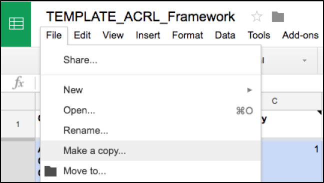
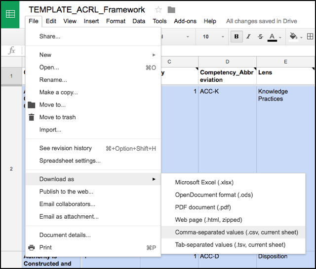
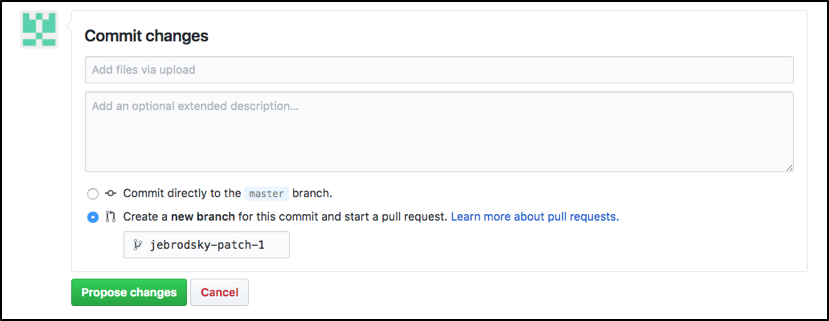
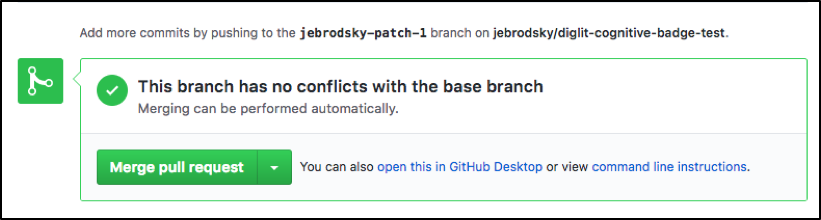
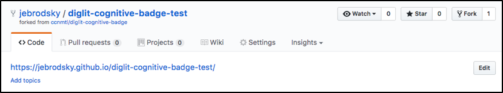
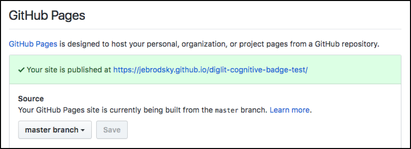

**Synopsis**
----------------------------------------

The Digital Literacy Competency Calculator (DLCC) is a web-based tool to represent the connection between digital literacy competencies and the teaching and learning practices that produce them. Representations produced with this tool allow learners to see exactly what is involved in mastering a digital skill, how a specific learning experience contributes to their mastery, and what they will be able to do to show mastery.

**Motivation**
-------------------------------------------

The Digital Literacy Competency Calculator is part of the [Digital Literacy for Instructional Practices Program](http://ctl.columbia.edu/programs/seminars/digital-literacy-instructional-practices/) at the Columbia University Center for Teaching and Learning and Columbia University Libraries. Please see our [DLCC White Paper](https://docs.google.com/document/d/11Em2vX-jJw_4QoP62STwVo1i5cNi81ARft9j7gOQsoA/edit?usp=sharing) for background on this project.

Through our work with Columbia faculty, we have initially identified three types of digital literacy frameworks that align well with higher education instructional settings and goals. These frameworks are:

-   **Eshet’s Cognitive Skills Framework**, based on cognitive skills for digital literacy identified in [Eshet (2012)](http://iisit.org/Vol9/IISITv9p267-276Eshet021.pdf).

-   **MIT’s Digital Humanities Framework**, based on competencies and learning outcomes identified in [Schnapp et al.’s MIT Short Guide to Digital Humanities](http://jeffreyschnapp.com/wp-content/uploads/2013/01/D_H_ShortGuide.pdf).

-   **ACRL’s Framework**, based on the [Association of College and Research Libraries’ (ACRL) Information Literacy](http://www.ala.org/acrl/standards/ilframework) standard.

We made our selection based on several criteria, including the
following:

-   Alignment of the standard’s principles with academic content

-   Flexibility and potential to be customized for different instructional settings

-   Articulation of competencies that, when paired with learning activities, can be measured for mastery

As part of this release of the DLCC, we have prototyped representations
for these three frameworks, available in the following repositories:

-   Eshet’s Cognitive Skills Framework:[https://github.com/ccnmtl/diglit-cognitive-badge](https://github.com/ccnmtl/diglit-cognitive-badge)

-   MIT’s Digital Humanities Competencies Framework:[https://github.com/ccnmtl/diglit-dh-badge](https://github.com/ccnmtl/diglit-dh-badge)

-   ACRL’s Framework:[https://github.com/ccnmtl/diglit-acrl-badge](https://github.com/ccnmtl/diglit-acrl-badge)

We encourage instructors to customize these representations based on
their instructional plan and the actual skills being covered in their
course or bootcamp.

**Installation**
------------------------------------------------------------------

1.  Choose the the framework that is most appropriate for your instructional context. Please see Choosing Your Framework in our[Digital Literacy Instructional Design Process](https://docs.google.com/document/d/1dChIUmHyUDAgzAV5Wt3h8QZlkrqedgSnR0bsoQz2U9w/edit?usp=sharing).

    a.  [The ACRL Framework](https://docs.google.com/spreadsheets/d/1Im8N3deuB-bLaRadCevr2vpb-CjO_EThNtvV-mdBpwY/edit?usp=sharing)

    b.  [Eshet’s Cognitive Skills Framework](https://docs.google.com/spreadsheets/d/12kCXyRT_QJ7gI0yYF4TMSK-Dlie3Yj1fc-vH0_5giCI/edit?usp=sharing)

    c.  [MIT’s Digital Humanities Framework](https://docs.google.com/spreadsheets/d/1ZjeoO_hf3EbodS1-SUxg9jrViDcENWSGBrefv702TJI/edit?usp=sharing)

2.  Create a repository for your Digital Literacy Competency Calculator in your GitHub account (*please see below for instructions on how to do this*).

3.  Make a copy of the Google Sheets DLCC template for the framework you selected:

4.  Customize the spreadsheet to match your instructional design. Please see our [Digital Literacy Instructional Design Process](https://docs.google.com/document/d/1dChIUmHyUDAgzAV5Wt3h8QZlkrqedgSnR0bsoQz2U9w/edit?usp=sharing).

5.  When you are happy with the spreadsheet, download it as a Comma-Separated Values and name the file “**standards**”.

6.  Go to the “csv” folder inside the “images” folder in your repository. Drag the file “standards.csv” into the “csv” folder. It should replace the existing “standards.csv” file.

7.  Describe your change and create a new branch for this commit and start a pull request. ([**What is a pull request?**](https://help.github.com/articles/about-pull-requests/))

8.  Go to the “index.html” file in your repository and edit the Title (line 203) and descriptions (line 206) to suit your context. Describe your change and create a new branch for this commit and start a pull request.

    a.  Note: All other descriptions (for lenses, pop up box copy, etc.) are determined by your “standards.csv” file. To make further changes to description, you must make changes in your Google Sheet and upload a new “standards.csv” file with your changes. We discourage editing in the standards.csv file directly.

9.  Review your changes to “standards.csv” and “index.html” and merge your pull requests with the master branch. (**[How do I merge a pull request?](https://help.github.com/articles/merging-a-pull-request/))**

10.  Share the link for your representation!

**Creating Your Own Digital Literacy Competency Calculator Repository on GitHub**
------------------------------------------------------------------

GitHub’s documentation is available [here](https://help.github.com/).

1.  Navigate to the repository you want to create.

    a.  ACRL’s Framework:[https://github.com/ccnmtl/diglit-acrl-badge](https://github.com/ccnmtl/diglit-acrl-badge)

    b.  MIT’s Digital Humanities Framework:[https://github.com/ccnmtl/diglit-dh-badge](https://github.com/ccnmtl/diglit-dh-badge)

    c.  Eshet’s Cognitive Skills Framework:[https://github.com/ccnmtl/diglit-cognitive-badge](https://github.com/ccnmtl/diglit-cognitive-badge)

2.  Fork the repository ([**How do I fork a repository?**](https://help.github.com/articles/fork-a-repo/))

3.  Navigate to your repository “Settings”.

    a.  Change the name of the repository. ([**How do I rename a repository?**](https://help.github.com/articles/renaming-a-repository/))

    b.  Scroll down to GitHub Pages. Under Source, select “master branch”. Click Save. Your site with your Digital Literacy Competency Calculator is now published

4.  Copy the link to your site into the description of your repository for easy reference.

5.  Edit the repository content.

    a.  Tip 1: Recommended workflow is to create a branch from the master and make edits in that branch. Once you have made your edits, create a pull request. A peer can then review changes and merge your changes with the Master.

    b.  Tip 2: If you are working alone, it is still recommended that you create a pull request with your changes and then merge the changes yourself.

**Contributors**
----------------

The Digital Literacy Competency Calculator is part of the [Digital Literacy for Instructional Practices Program](http://ctl.columbia.edu/programs/seminars/digital-literacy-instructional-practices/) at the Columbia University Center for Teaching and Learning and Columbia University Libraries. Contributors to this project are:

-   Lucy Appert
-   Jessica Brodsky
-   Susan Dreher
-   Amy Nurnberger
-   Marc Raymond

Please contact Lucy Appert([lucy.appert@columbia.edu](mailto:lucy.appert@columbia.edu)) for assistance.

**License**
-----------

This was developed by the Columbia University Center for Teaching & Learning (CTL) and the Columbia University Libraries.

Copyright (c) 2017 Center for Teaching and Learning at Columbia University.

Code licensed GNU GPLv3 (https://www.gnu.org/licenses/gpl-3.0.en.html), content CC BY-SA 4.0 (https://creativecommons.org/licenses/by-sa/4.0/).
